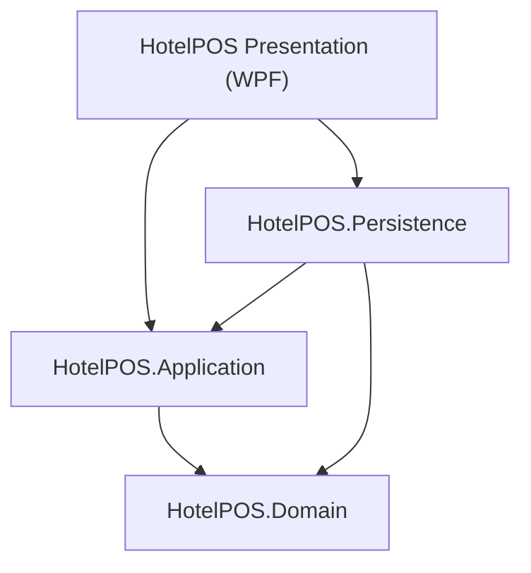

# HotelPOS System Design Document

## 1. Architectural Overview
HotelPOS follows **Clean Architecture** principles to ensure strict separation of concerns, testability, decoupling of external dependencies, and maintainability.

### Layer Definitions
| Layer | Responsibility | Key Components |
| :--- | :--- | :--- |
| **Domain** | Core Enterprise Business Logic & Entities | `Item`, `Order`, `SystemSetting`, `User`, `Supplier` |
| **Application** | Business Use Cases & Service Interfaces | `ICartService`, `IOrderService`, `IItemService`, `ISupplierService` |
| **Persistence** | Data Access & Repositories (EF Core) | `HotelDbContext`, Migrations, SQL Server |
| **Presentation (WPF)** | User Interface (MVVM) & Desktop-Specific Infrastructure | `BillingViewModel`, `LedgerView`, `ThemeService`, `BackupService` |

---

## 2. Core Modules & Logic

### 2.1 Billing & Cart Engine (`CartService`)
The heart of the POS is the `CartService`. Unlike orders which are saved directly to the database, the Cart manages **transient state** (active tables and customer bills).
- **Concurrency**: Uses thread-safe data structures (`ConcurrentDictionary` and `lock` objects) to handle rapid parallel billing updates.
- **Table Management**: Supports atomic `TransferTable` operations and `HoldOrder` (KOT) workflows.
- **Auto-Sequencing**: Items in the cart are sorted alphabetically with a dynamic `S.No` (Serial Number) reassigned on every update.

### 2.2 Print & Receipt Engine (`ReceiptGenerator`)
Generates high-fidelity documents for thermal and standard printers.
- **Format Agnostic**: Supports 80mm Thermal (FlowDocument-based) and standard layouts.
- **Compliance**: Dynamically switches between **Tax Invoice** and **Bill of Supply** based on the GST Composition Scheme setting.
- **KOT Support**: Generates Kitchen Order Tickets with bold table numbers and simplified item lists.

### 2.3 Tax & Compliance Logic
Specifically tailored for Indian GST regulations.
- **Regular Scheme**: Calculates CGST/SGST breakdown per item based on HSN/Tax categories.
- **Composition Scheme**: Hides tax details from customers and labels bills correctly while maintaining internal turnover tracking.

---

## 3. Key Design Refactorings & Thread Safety

### 3.1 DTO Organization (Clean Architecture Standards)
To maintain the integrity of Clean Architecture, all Request and Response Data Transfer Objects (DTOs) are strictly separated from application services and handlers.
- **Location**: Sub-categorized into domain-specific folders under `HotelPOS.Application/DTOs/` (e.g. `Item/`, `Order/`, `Table/`, `Report/`).
- **Discovery**: Enhances code readability, namespaces isolation, and maintainability across larger development teams.

### 3.2 WPF-Specific Infrastructure Relocation
Infrastructure services that are tightly coupled to the WPF UI framework reside strictly inside the Presentation project (`HotelPOS.WPF`), leaving the core Application assembly framework-agnostic.
- **`BackupService`**: Interacts with local drives to trigger automated background backups on startup.
- **`NotificationService`**: Triggers interactive toast popups for success, warning, and error messages.
- **`ThemeService`**: Manipulates WPF XAML resource dictionaries at runtime to toggle Light/Dark themes.

### 3.3 Thread-Safe DbContext Synchronization (`App.DbLock`)
Because WPF resolves services and view-models inside the shared logged-in session scope, concurrent asynchronous database queries from different tabs or background tasks could trigger EF Core concurrency exceptions.
- **Remediation**: Implements a global, non-reentrant synchronization semaphore (`App.DbLock`) across **14 major views and view-models** to serialize all database reads/writes safely.
- **Integration**: Every view-behind database call is safely wrapped inside `try-finally` blocks to ensure locks are always released.

---

## 4. UI/UX Standards
- **MVVM Pattern**: ViewModels communicate with Services via Dependency Injection.
- **Dynamic Theming**: `ThemeService` swaps `ResourceDictionaries` (Dark/Light mode) at runtime.
- **Keyboard First**: Optimized for rapid entry using `F4` (Checkout), `F1 / F3` (Search), and `Enter` (Submit).
- **Responsive Navigation**: Uses a tab-based system for multiple active bills, allowing cashiers to switch between tables instantly.

---

## 5. Technology Stack
- **Framework**: .NET 10 (Windows Desktop)
- **UI**: WPF (XAML) with CommunityToolkit.Mvvm
- **Database / ORM**: Microsoft SQL Server (Production & LocalDB) + EF Core 10
- **Exporting**: ClosedXML for robust, styled Excel report generation
