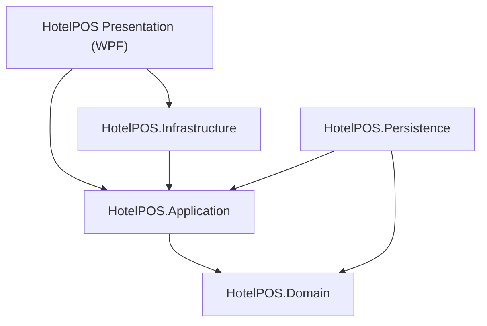

# HotelPOS System Design Document

## 1. Architectural Overview
HotelPOS follows **Clean Architecture** principles to ensure separation of concerns, testability, and maintainability. The system is partitioned into five distinct layers.

### Layer Definitions
| Layer | Responsibility | Key Components |
| :--- | :--- | :--- |
| **Domain** | Enterprise logic & Entities | `Item`, `Order`, `SystemSetting`, `User` |
| **Application** | Business logic & Interfaces | `ICartService`, `IOrderService`, `IItemService` |
| **Persistence** | Data Access (EF Core) | `HotelDbContext`, Migrations, SQL Server/SQLite |
| **Infrastructure** | System Services | `NotificationService`, `ThemeService`, Hardware I/O |
| **Presentation** | User Interface (MVVM) | `BillingViewModel`, `DashboardView`, `ReceiptGenerator` |

---

## 2. Core Modules & Logic

### 2.1 Billing & Cart Engine (`CartService`)
The heart of the POS is the `CartService`. Unlike orders which are saved to the DB, the Cart manages **transient state** (active tables).
- **Concurrency**: Uses `ConcurrentDictionary` and `lock` objects to handle rapid billing updates.
- **Table Management**: Supports atomic `TransferTable` operations and `HoldOrder` (KOT) workflows.
- **Auto-Sequencing**: Items in the cart are sorted alphabetically with a dynamic `S.No` (Serial Number) reassigned on every update.

### 2.2 Print & Receipt Engine (`ReceiptGenerator`)
Generates high-fidelity documents for thermal and standard printers.
- **Format Agnostic**: Supports 80mm Thermal (Browser-like FlowDocument) and A4 formats.
- **Compliance**: Dynamically switches between **Tax Invoice** and **Bill of Supply** based on the GST Composition Scheme setting.
- **KOT Support**: Generates Kitchen Order Tickets with bold table numbers and simplified item lists.

### 2.3 Tax & Compliance Logic
Specifically tailored for Indian GST regulations.
- **Regular Scheme**: Calculates CGST/SGST breakdown per item based on HSN/Tax categories.
- **Composition Scheme**: Hides tax details from customers and labels bills correctly while maintaining internal turnover tracking.

---

## 3. Data Flow

### 3.1 Order Lifecycle
1. **Search/Add**: User adds item via `BillingViewModel`. `CartService` updates in-memory state.
2. **KOT**: User clicks "Hold". `CartService` moves items to a `HeldOrder`. KOT is printed via `ReceiptGenerator`.
3. **Checkout**: User clicks "Save". `OrderService` maps the Cart items to a persistent `Order` entity.
4. **Persistence**: `HotelDbContext` saves to SQL Server. `CartService` clears the table.
5. **Print**: A final receipt is generated and sent to the `DefaultPrinter`.

### 3.2 Shift & Cash Management
The `CashService` tracks the `Session`.
- **Opening Shift**: Records opening balance.
- **Real-time Tracking**: Orders are linked to the active session.
- **Closing Shift**: Calculates total sales vs. cash in hand and generates an audit log.

---

## 4. UI/UX Standards
- **MVVM Pattern**: ViewModels communicate with Services via Dependency Injection.
- **Dynamic Theming**: `ThemeService` swaps `ResourceDictionaries` (Dark/Light mode) at runtime.
- **Keyboard First**: Optimized for rapid entry using `F4` (Checkout), `F1` (Search), and `Enter` (Submit).
- **Responsive Navigation**: Uses a tab-based system for multiple active bills, allowing waiters to switch between tables instantly.

---

## 5. Technology Stack
- **Framework**: .NET 10 (Windows Desktop)
- **UI**: WPF (XAML) with CommunityToolkit.Mvvm
- **Database**: MS SQL Server (Production) / SQLite (Local/Test)
- **ORM**: Entity Framework Core
- **Reporting**: FlowDocument (Internal) / FastReport (Advanced Exports)
